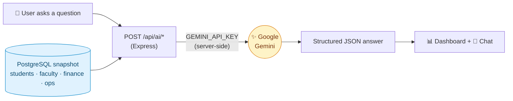
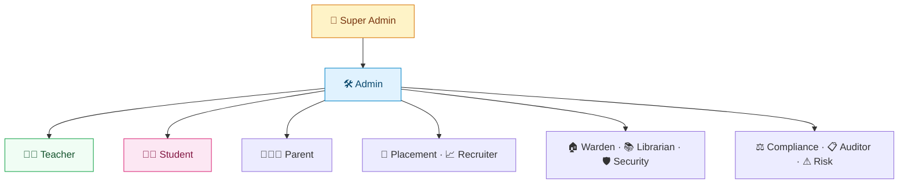
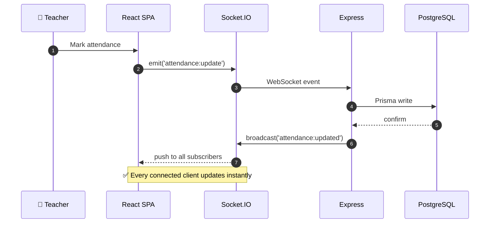

<!-- =====================================================================
     🎓  UNIVERSITY MANAGEMENT SYSTEM (UMS) — Premium Project-Report README
     ---------------------------------------------------------------------
     ✅ Satisfies report constraints a–g:
        a) name · problem · audience     b) live URL     c) full features
        d) AI feature + system prompt    e) tools/AI     f) 3+ screenshots
        g) run instructions

     🎨 BEFORE YOU PUBLISH — replace:
        1. 🔍 "REPLACE_LIVE_URL" → your production deploy link
        2. 🖼️  swap placehold.co screenshots with files in /assets
        3. 🤖 paste your exact Gemini prompt from src/services (AI section)
        4. 🎓 save the UMS hero banner I generated as assets/ums-banner.svg
===================================================================== -->

<div align="center">


<!-- 🎓 no banner yet? use this placeholder instead:

-->

# 🎓 University Management System (UMS)

### *Enterprise ERP · Real‑Time · AI‑Powered*

A modern, full‑stack university ERP built with **React 19 · TypeScript · Express · Prisma · PostgreSQL · Socket.IO · Google Gemini AI**.

<br/>

[](https://nodejs.org/)
[](https://react.dev/)
[](https://www.typescriptlang.org/)
[](https://www.postgresql.org/)
[](https://www.prisma.io/)
[](https://socket.io/)
[](https://vite.dev/)
[](https://tailwindcss.com/)

<br/><br/>

<!-- ⚠️ REPLACE_LIVE_URL -->
[](https://ums.vercel.app)
[](https://ai.studio/apps/5c1f8d4c-a9ba-406b-aa25-0dea058a2dfc)
[](https://github.com/yourusername/ums)

</div>

> [!IMPORTANT]
> ### 🔗 Live Application
>  vercal app make problem demo data removed <br>
>https://final-project-2-university-manageme-roan.vercel.app/  <br>
>google ai studio>>https://ai.studio/apps/5c1f8d4c-a9ba-406b-aa25-0dea058a2dfc?fullscreenApplet=true
> 🔑 **Default login (seeded) →** Username `admin` · Password `admin123` *(Super Admin — change immediately)*

---

## 📊 At a Glance

<table>
<tr>
<td align="center" width="20%">👥<br/><br/><b>14+</b><br/><sub>USER ROLES</sub></td>
<td align="center" width="20%">⚡<br/><br/><b>Socket.IO</b><br/><sub>REAL-TIME</sub></td>
<td align="center" width="20%">🤖<br/><br/><b>Gemini</b><br/><sub>AI ASSISTANT</sub></td>
<td align="center" width="20%">🧩<br/><br/><b>12+</b><br/><sub>MODULES</sub></td>
<td align="center" width="20%">🔐<br/><br/><b>RBAC</b><br/><sub>+ PERMISSIONS</sub></td>
</tr>
</table>

<br/>

<div align="center">

### 📖 Overview


</div>

Most universities still run on a patchwork of spreadsheets, paper registers, and disconnected legacy tools. Enrollment doesn't talk to the hostel warden, fee payments don't sync with exam eligibility, library fines live in a separate sheet, and leadership has no single dashboard for institutional health. The result is wasted time, data errors, and accreditation audits that turn into fire drills.

The **University Management System (UMS)** is a full‑stack, **enterprise‑grade ERP** that brings every corner of a university under one unified roof — a complete digital ecosystem for:

> 🎓 Academics · 👨‍🎓 Student Lifecycle · 👨‍🏫 Faculty · 📚 Library · 🏠 Hostel · 🚌 Transport · 💰 Finance · 📊 Analytics · 🤖 AI Assistant · 🔔 Real‑Time Notifications · 📑 Accreditation · 🔒 Security & Compliance

It follows a **Layered Modular Monolith Architecture** for maintainability, scalability, and clean code organization.

> [!NOTE]
> 🎓 **Built by Akhtar Ali** — designed for real institutional use, not just academic submission.

<table>
<tr>
<td width="50%">

**⚡ Why it's different**
- 🏛️ **Layered modular monolith** — clean, scalable separation of concerns
- ⚡ **Real‑time** attendance, timetable & notifications via Socket.IO
- 🤖 **Gemini‑powered** academic assistant & recommendations
- 👥 **14 roles** with granular RBAC + permission system
- 📡 **Prometheus‑ready** monitoring out of the box
- 🛡️ Enterprise security: Helmet, CORS, rate limiting, JWT refresh

</td>
<td width="50%">

**🎯 Built for**
- 🏛️ Multi‑campus universities
- 🎓 Engineering & professional colleges
- 📑 Institutions pursuing NAAC / NBA accreditation
- 🧑‍💼 Administrators needing unified oversight
- 👨‍🎓 Students, faculty & parents
- 👨‍💻 Developers learning enterprise architecture

</td>
</tr>
</table>

---

## 🧭 Table of Contents

<div align="center">

[🖼️ Screenshots](#-screenshots) · [✨ Features](#-core-features) · [🤖 AI](#-the-ai-feature) · [🔐 Auth & Roles](#-authentication--roles) · [⚡ Real-Time](#-real-time-features) · [🏗️ Architecture](#️-system-architecture) · [🔄 Data Flow](#-data-flow) · [🛠️ Stack](#️-tech-stack) · [📁 Structure](#-project-structure) · [🚀 Run](#-getting-started) · [📡 Monitoring](#-monitoring) · [🛡️ Security](#️-security) · [📈 Future](#-future-improvements) · [🤝 Contributing](#-contributing)

</div>

<br/>

<div align="center">

### 🖼️ Screenshots


</div>

<!-- 🖼️  REPLACE placehold.co URLs with: assets/dashboard.png · students.png · academics.png · ai.png -->

<table>
<tr>
<td align="center" width="50%">

<br/><sub><b>① Admin Dashboard</b> — KPIs, charts & real‑time metrics</sub>
</td>
<td align="center" width="50%">

<br/><sub><b>② Student Management</b> — profiles, enrollment & records</sub>
</td>
</tr>
<tr>
<td align="center">

<br/><sub><b>③ Academics</b> — courses, timetable & attendance</sub>
</td>
<td align="center">

<br/><sub><b>④ AI Assistant</b> — chat, insights & recommendations</sub>
</td>
</tr>
</table>

<br/>

<div align="center">

### ✨ Core Features


</div>

<table>
<tr>
<td width="33%" valign="top">

**🎓 Academic**
Student, Faculty, Department, Program, Course, Subject, Semester & Section management · Enrollment · Attendance · Timetable · Assignments · Quizzes · Examinations · Results · **Transcript Generation** · **Degree Audit**.

</td>
<td width="33%" valign="top">

**🏢 Campus Operations**
🏠 Hostel · 📚 Library · 🚌 Transport · 🏫 Room Booking · 🛒 Procurement · 📦 Inventory · 🚪 Visitor Management · 🔐 Security.

</td>
<td width="33%" valign="top">

**💰 Finance**
Fee Collection · Scholarships · Online Payments · Financial Reports.

</td>
</tr>
<tr>
<td valign="top">

**🧑‍💼 Administration**
Alumni · Placement · Recruitment · Research · Accreditation · Workflow Engine · CMS · **Multi‑Tenant Support**.

</td>
<td valign="top">

**🤖 AI Features**
Google Gemini AI Assistant · AI Chat · AI Recommendations · AI Academic Support.

</td>
<td valign="top">

**📊 Enterprise**
Analytics Dashboard · Audit Logs · Notifications · Search · Reports · **Role‑Based Access Control** · Permission System.

</td>
</tr>
</table>

<br/>

<div align="center">

### 🤖 The AI Feature


</div>

The built‑in **UMS Assistant**, powered by **Google Gemini**, turns institutional data into guidance:

- 💬 Answers plain‑English questions — *"Which students are at risk this semester?"*, *"Show hostel occupancy trends"*
- 🎓 Gives **academic recommendations** grounded in performance & attendance patterns
- 🚨 Flags **fee defaulters, timetable clashes, low attendance, and accreditation gaps**
- 📝 Produces **structured reports** → `headline · key metrics · insights · risks · actions`

> [!TIP]
> 🔐 The AI **never touches the browser directly**. The client calls `/api/ai/*`, and the **Express server injects `GEMINI_API_KEY` server‑side** — so your key is never exposed.



**📜 The system prompt behind it** *(see `src/services/`)*:

```text
You are "UMS Assistant", the embedded academic AI inside the University
Management System — an enterprise ERP serving a multi-campus university.

CONTEXT
You receive a JSON snapshot of institutional data: students (grades,
attendance, enrollment, fee status), faculty, departments, programs,
courses, timetables, hostel occupancy, library usage and accreditation
records. Treat this snapshot as the ONLY source of truth.

TASKS
1. Answer plain-English questions about academics, operations and finance.
2. Proactively surface: at-risk students (low attendance/grades), fee
   defaulters, timetable clashes, hostel capacity issues, accreditation gaps.
3. Give academic recommendations grounded in performance trends.
4. When asked for a "report", return a structured summary:
   { headline, key_metrics[], insights[], risks[], actions[] }.

RULES
- NEVER invent students, grades or figures. If data is missing, say so.
- Cite specific departments, courses, semesters or IDs when possible.
- Quantify everything ("CS attendance down 18% this semester").
- Prioritize student welfare and accreditation compliance.
- Be concise and professional — write for faculty and administrators.
- If a question is outside the data, reply:
  "I can't find that in the university database."
```

<br/>

<div align="center">

### 🔐 Authentication & Roles


</div>

✅ JWT Authentication · ✅ Refresh Tokens · ✅ Firebase Authentication · ✅ Role‑Based Access Control · ✅ Permission‑Based Authorization

**👥 14 Supported Roles**

<div align="center">

| | | |
|:---|:---|:---|
| 👑 Super Admin | 🛠 Admin | 👨‍🏫 Teacher |
| 👨‍🎓 Student | 👨‍👩‍👧 Parent | 📈 Recruiter |
| 💼 Placement Officer | 🏠 Hostel Warden | 🛡 Security Staff |
| 📚 Librarian | ⚖ Compliance Officer | 📋 Internal Auditor |
| ⚠ Risk Manager | 📑 Auditor | |

</div>



<br/>

<div align="center">

### ⚡ Real-Time Features


</div>

Powered by **Socket.IO** — 🔔 Notifications · 📅 Timetable Updates · ✅ Attendance Updates · 💬 Chat · 📊 Dashboard Updates · 📢 Event Broadcasting.



<br/>

<div align="center">

### 🏗️ System Architecture


</div>

A **Layered Modular Monolith** — clean separation of concerns, scalable within a single deployable unit.

```text
                    🌐 Browser (React SPA)
                             │
               REST API / WebSocket (Socket.IO)
                             │
                    🚀 Express Server
                             │
        ┌───────────────────────────────────────┐
        │ Authentication │ Authorization │ Logs │
        └───────────────────────────────────────┘
                             │
                     📂 Controllers
                             │
                     ⚙️ Services
                             │
                    🗄️ Repositories
                             │
                     Prisma ORM Client
                             │
                     PostgreSQL Database
```

<br/>

<div align="center">

### 🔄 Data Flow


</div>

```text
🌐 Browser → ⚛️ React → 🌍 REST API → 🚀 Express → 🔐 JWT Middleware
   → 📂 Controller → ✔ Zod Validation → ⚙️ Service → 🗄 Repository
   → 🔥 Prisma → 🐘 PostgreSQL
```

<br/>

<div align="center">

### 🛠️ Tech Stack


</div>

<div align="center">

**Frontend**


**State · Validation**


**Backend · Data · Real-Time**


**AI · Charts · Export**


</div>

| Layer | Technology |
|---------|------------|
| 🎨 Frontend | React 19 + TypeScript + Vite |
| 💅 Styling | TailwindCSS |
| ⚙️ Backend | Express.js |
| 🗄️ Database | PostgreSQL |
| 🔥 ORM | Prisma |
| 🔐 Authentication | JWT + Firebase |
| 🔄 Real-Time | Socket.IO |
| 📦 State | Zustand |
| 🌐 Server State | TanStack Query |
| ✔ Validation | Zod |
| 🤖 AI | Google Gemini |
| 📊 Charts | ECharts + Recharts |
| 📄 PDF | PDFKit |
| 📱 QR | QRCode |
| 📌 Barcode | JsBarcode |

<br/>

<div align="center">

### 📁 Project Structure


</div>

```bash
📦 ums
├── 📂 prisma
│   ├── schema.prisma
│   └── seed.ts
│
├── 📂 src
│   ├── 📂 components
│   ├── 📂 controllers
│   ├── 📂 errors
│   ├── 📂 features
│   ├── 📂 hooks
│   ├── 📂 middleware
│   ├── 📂 pages
│   ├── 📂 providers
│   ├── 📂 repositories
│   ├── 📂 routes
│   ├── 📂 services
│   ├── 📂 socket
│   ├── 📂 store
│   ├── 📂 types
│   └── 📂 validators
│
├── 🚀 server.ts
├── 📄 package.json
└── 📖 README.md
```

<br/>

<div align="center">

### 🚀 Getting Started


</div>

**✅ Prerequisites** — Node.js ≥ `20.x` · PostgreSQL 16 · a [Gemini API key](https://aistudio.google.com/apikey) · Firebase service-account credentials

**1️⃣ Clone repository**
```bash
git clone https://github.com/yourusername/ums.git
cd ums
```

**2️⃣ Install dependencies**
```bash
npm install
```

**3️⃣ Configure environment** *(create `.env` / `.env.local`)*
```env
DATABASE_URL=

JWT_SECRET=
JWT_REFRESH_SECRET=

PORT=5000

FIREBASE_PROJECT_ID=
FIREBASE_CLIENT_EMAIL=
FIREBASE_PRIVATE_KEY=

GEMINI_API_KEY=
```

**4️⃣ Initialize Prisma**
```bash
npx prisma generate
npx prisma migrate dev
npx prisma db seed
```

**5️⃣ Run the dev server**
```bash
npm run dev          # 🌐 http://localhost:5000
```

**6️⃣ Production build**
```bash
npm run build
```

> [!TIP]
> 🧪 **Prefer zero setup?** View the live app in **AI Studio** → [ai.studio/apps/5c1f8d4c…](https://ai.studio/apps/5c1f8d4c-a9ba-406b-aa25-0dea058a2dfc). Just set `GEMINI_API_KEY` in `.env.local` and run `npm run dev`.

> [!NOTE]
> ☁️ **To get your live URL:** deploy to **Vercel / Render / Railway**, set every env var in the host dashboard, then paste the URL into the **LIVE_DEMO** badge at the top.

<br/>

<div align="center">

### 📡 Monitoring


</div>

| Endpoint | Description |
|----------|-------------|
| ❤️ `/health` | Liveness |
| 💚 `/ready` | Readiness |
| 📊 `/metrics` | Prometheus |
| 🩺 `/api/health` | Application Health |

<br/>

<div align="center">

### 🛡️ Security


</div>

🛡 Helmet · 🌍 CORS · 🚦 Rate Limiting · 🔐 JWT · 🔄 Refresh Tokens · 🔑 RBAC · ✔ Input Validation · 🔒 Secure Headers

<br/>

<div align="center">

### 📈 Future Improvements


</div>

⚡ Redis Cache · 📨 BullMQ Jobs · ☁ AWS S3 / MinIO · 🔎 Elasticsearch · 🐳 Docker · ☸ Kubernetes · 📊 Grafana · 📈 Prometheus · 🌐 Microservices

<br/>

<div align="center">

### 🤝 Contributing


</div>

Contributions are welcome!

1. 🍴 Fork the repository
2. 🌿 Create a new branch
3. 💻 Commit your changes
4. 🚀 Push your branch
5. 🔥 Open a Pull Request

<br/>

<div align="center">

### 👨‍💻 Developer


<br/><br/>

**Akhtar Ali**

*Computer Science Student & Developer*

<br/>


<br/><br/>

### ❤️ Built With Love for Education

**University Management System** · by **Akhtar Ali**

</div>

---

## 📜 License

Licensed under the **MIT License**.

---

<div align="center">

### ⭐ If you like this project, consider giving it a Star!

Made with ❤️ using React, Express, Prisma & PostgreSQL

</div>

<!-- =====================================================================
     OPTIONAL: Star History chart (uncomment when repo is public):
<a href="https://star-history.com/#yourusername/ums&Date">
 <picture>
   <source media="(prefers-color-scheme: dark)" srcset="https://api.star-history.com/svg?repos=yourusername/ums&type=Date&theme=dark" />
   
 </picture>
</a>
===================================================================== -->
